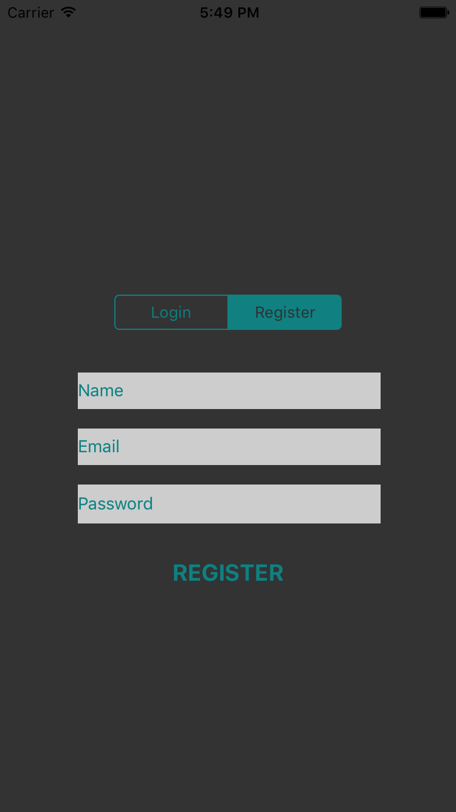
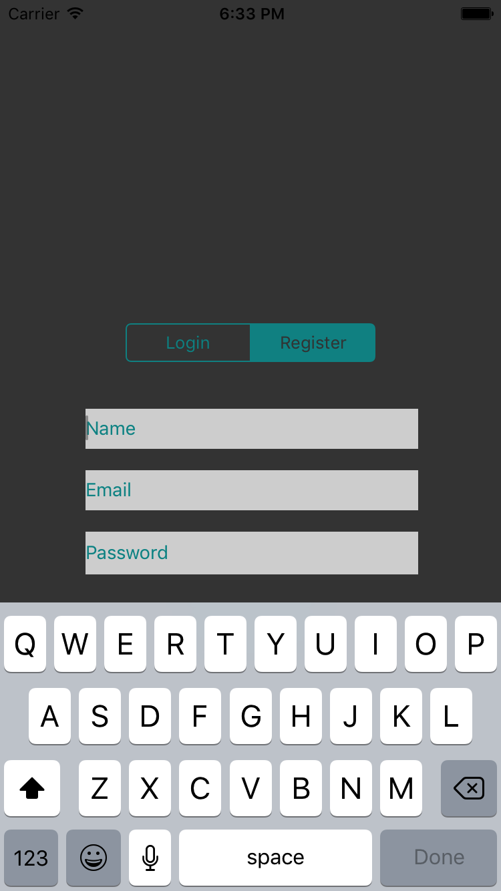
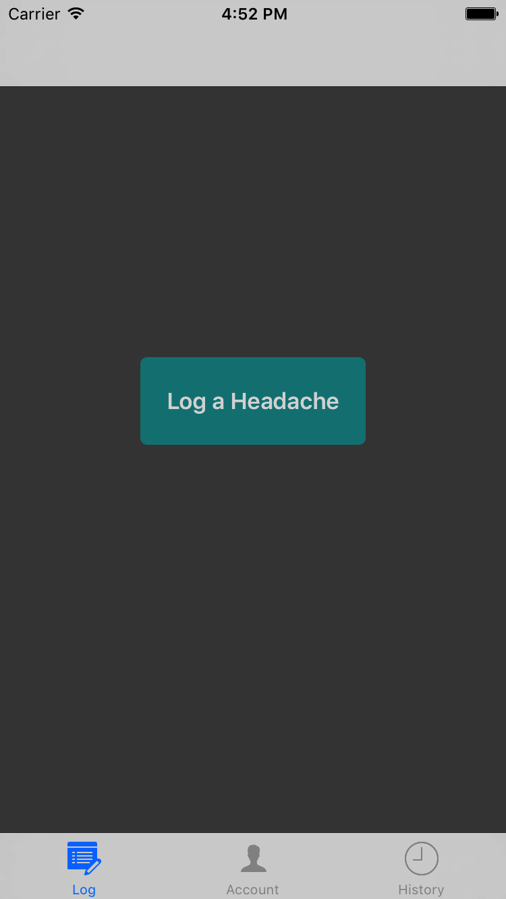
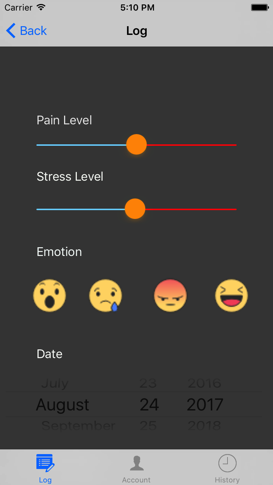
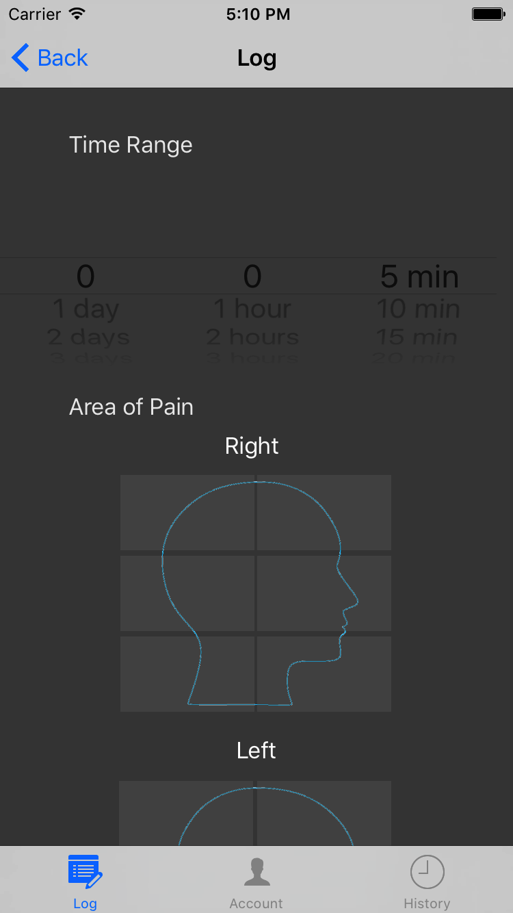
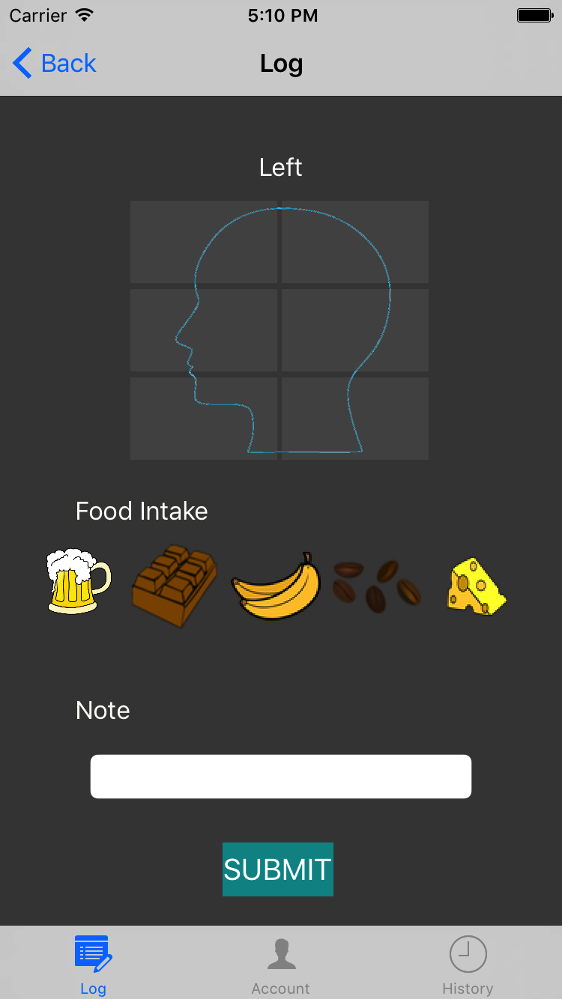
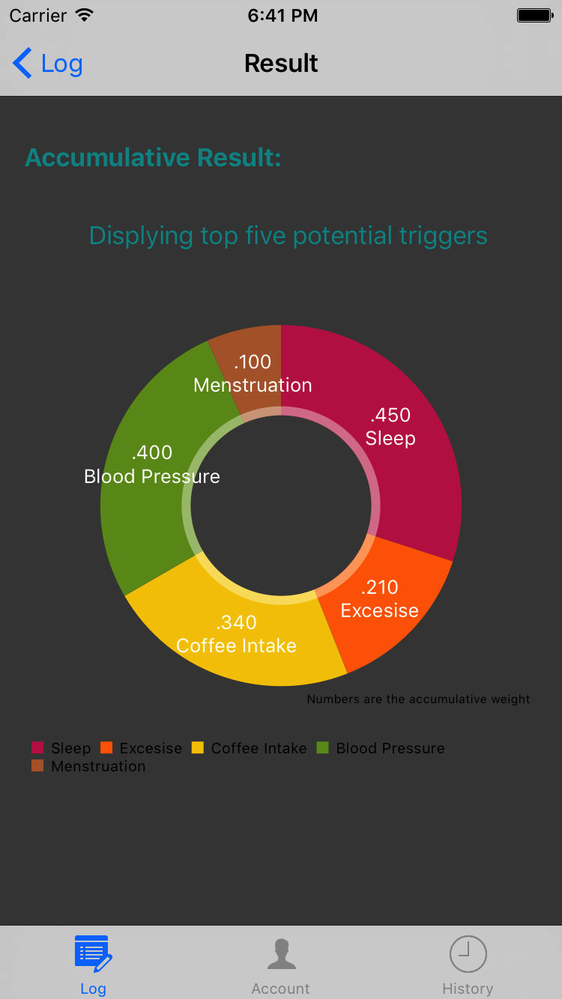
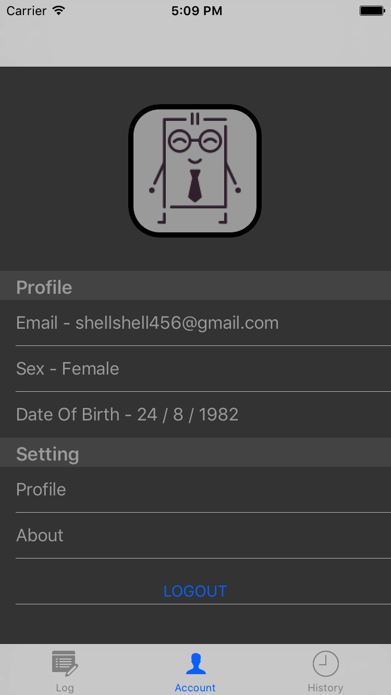
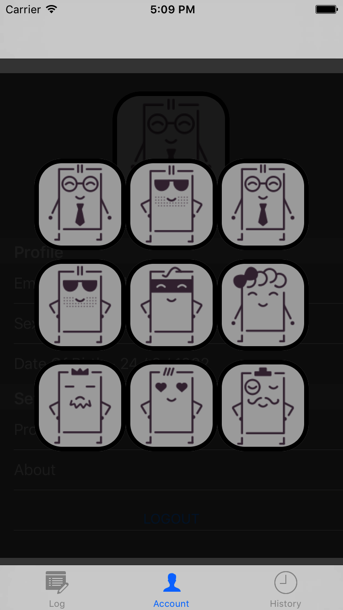

# Migraine Killer
##### This is a smart application that identifies triggers for long-term diseases such as Migraine headache and concussion
## Purpose 
##### To improve existing migraine diary applications which do not attempt to include environmental factors, physiological states and frequently do not allow for capture of such important information as stress, emotions, and distribution of pain.
## Function 
##### Allow patients to keep track of headache symptoms and provide a real time analysis of potential triggers.  

## Features 

 

Login/Register Page View
 

Log View
 

 This is where we obtain patient's subjective information, including: 

<li> Headache pain level </li>
<li> Headache area </li>
<li> Stress level </li>
<li> Emotions </li>
<li> Food intake </li>
<li> Other notes </li>

Result View
 

Account View
 

## Technical
##### Health Kit
###### We retrieved personal health information from Apple Watch:
* Blood pressure
* Exercise (Steps)
* Sleep Analysis
* Menstruation
##### Database
* Firebase database and authentication 
* https://firebase.google.com/
##### Weather API
###### We also considered environmental aspects including:
* Temperature
* Barometric pressure
* Humidity

## Styles
##### We adapted a dark theme for the app to reduce vision stimuli to patients. 

## Future implementations
* User community to share experience and treatments
* Collect and study user data to build up dataset for Big Data analysis in order to provide better diagnosis
* Extend the scope of the app for other long-term diseases

## Reference
https://www.iconfinder.com/
https://icons8.com/
